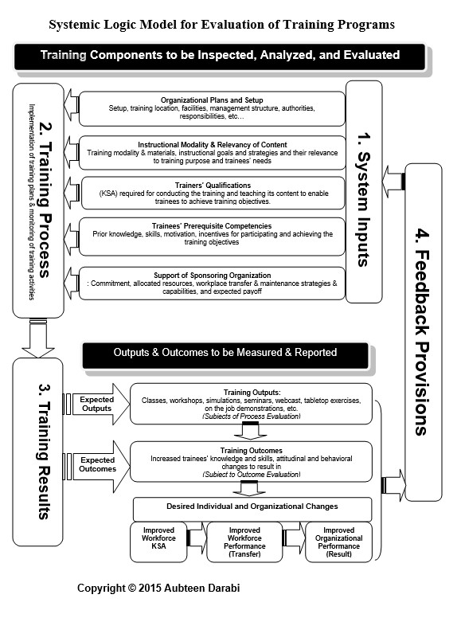
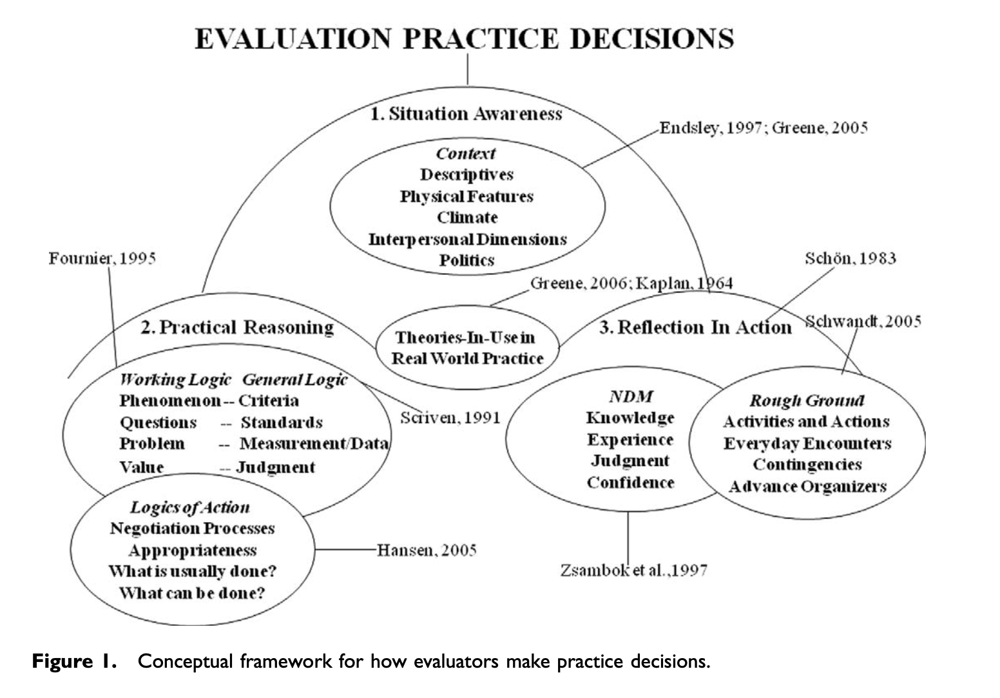
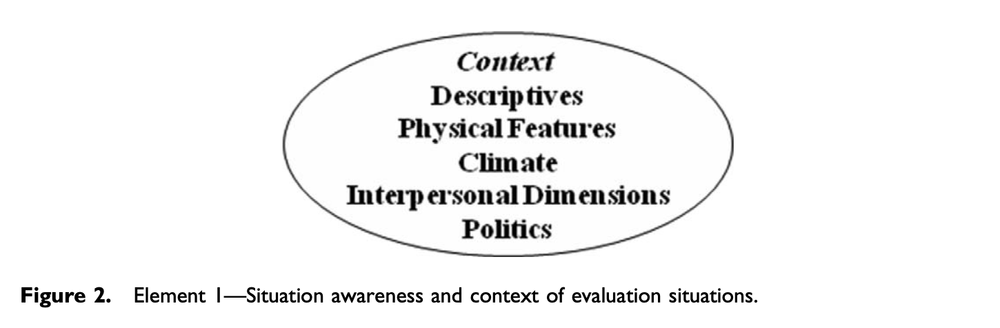
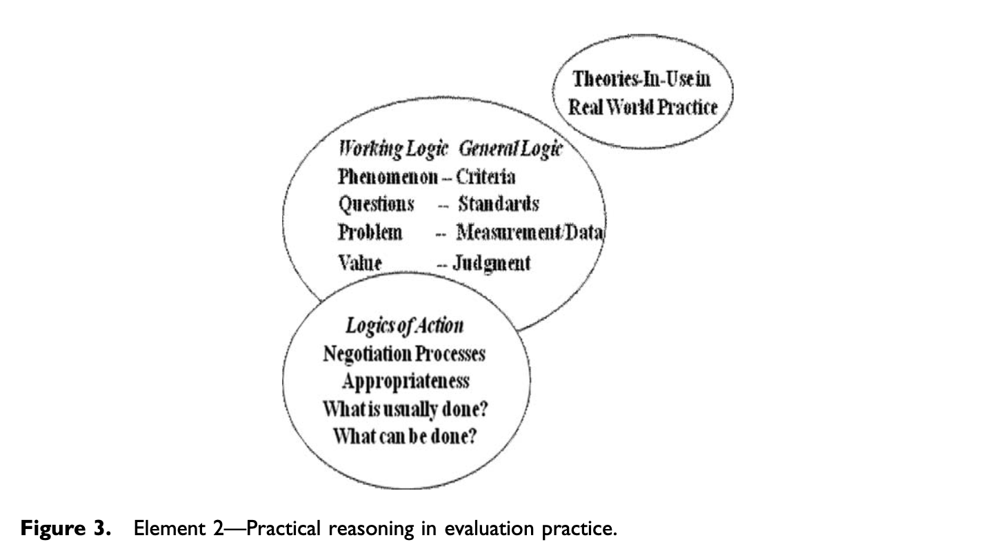
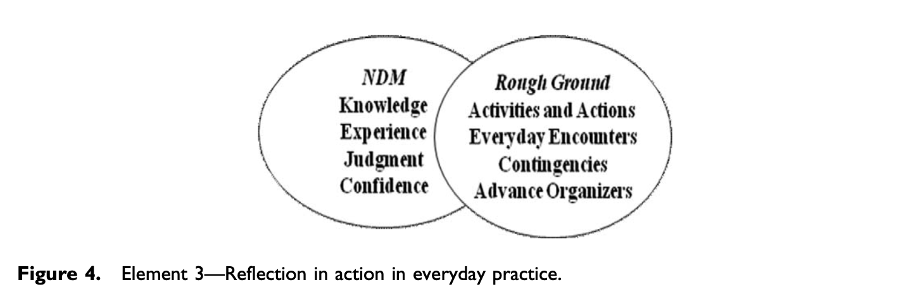
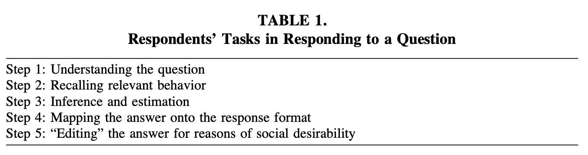

```{r setup, include=FALSE}
usethis::use_git_ignore(c("*.csv", "*.rds"))
options(htmltools.dir.version = FALSE)

library(knitr)
library(tidyverse)
library(xaringan)
library(fontawesome)
```

class: inverse, center, middle


# `r fa("far fa-images", fill = "#fff")`

**View the slides:** 

[bretsw.github.io/eme6357-module3](https://bretsw.github.io/eme6357-module3)

---

class: inverse, center, middle

# Team Dynamics

```{r, out.width = "720px", echo = FALSE, fig.align = "center"}
include_graphics("img/community.jpg")
```

---

class: inverse, center, middle

# `r fa("far fa-edit", fill = "#fff")` <br> Evaluation Plan

---

class: inverse, center, middle

# Systemic Logic Model

```{r, out.width = "420px", echo = FALSE, fig.align = "center"}

```

---

# Evaluation Plan, Part 2

```{r, out.width = "600px", echo = FALSE, fig.align = "center"}
include_graphics("img/group-project.jpg")
```

--

- Again, fantastic work

--

- Generally, great job introducing the problem and giving a needs statement

--

- Add some citations or hyperlinks to your introductions

---

# Evaluation Plan, Part 2

```{r, out.width = "600px", echo = FALSE, fig.align = "center"}
include_graphics("img/group-project.jpg")
```

- For non-traditional training, think about where **expertise** resides

--

  - Potentially, in peers, not just the facilitator

---

# Evaluation Plan, Part 2

```{r, out.width = "600px", echo = FALSE, fig.align = "center"}
include_graphics("img/group-project.jpg")
```

- Focus on the importance of **transfer** (Kirkpatrick's levels 2-4: learning, behavior, results)

--

- Remember the distinction between **outputs** and **outcomes**

---

# Evaluation Plan, Part 2

```{r, out.width = "600px", echo = FALSE, fig.align = "center"}
include_graphics("img/group-project.jpg")
```

- Try to go a step deeper: offer some **critique**, not just description

--

  - For example, if you comment on the facilitator's credentials, also try to answer, "So what?"

---

class: inverse, center, middle

# Systemic Logic Model

```{r, out.width = "420px", echo = FALSE, fig.align = "center"}

```

---

class: inverse, center, middle

# `r fa("far fa-comments", fill = "#fff")` <br> Flipgrid Discussions

---

# Flipgrid Discussions: Feedback

```{r, out.width = "720px", echo = FALSE, fig.align = "center"}
include_graphics("img/chat.jpg")
```

---

class: inverse, center, middle

# `r fa("fas fa-quote-left", fill = "#fff")` <br> Module 2 lecture: Tradeoffs

---

class: inverse, center, middle

<div class="padlet-embed" style="border:1px solid rgba(0,0,0,0.1);border-radius:2px;box-sizing:border-box;overflow:hidden;position:relative;width:100%;background:#F4F4F4"><p style="padding:0;margin:0"><iframe src="https://fsu.padlet.org/embed/2be7mvchzccn5l4n" frameborder="0" allow="camera;microphone;geolocation" style="width:100%;height:480px;display:block;padding:0;margin:0"></iframe></p><div style="padding:8px;text-align:right;margin:0;"><a href="https://padlet.com?ref=embed" style="padding:0;margin:0;border:none;display:block;line-height:1;height:16px" target="_blank"></a></div></div>

---

# Self-Report Research

```{r, out.width = "480px", echo = FALSE, fig.align = "center"}

```

- Humans are bad at estimating

--

  - (People are also bad at remembering)

--

- People change once they know you're observing

--

### `r fa("arrow-right", fill = "#782F40")` Observer Effect

---

class: inverse, center, middle

# `r fa("fas fa-book-open", fill = "#fff")` <br> Module 3 readings: <br> Evaluation Methodology

---

# Brandon et al. (2011)

```{r, out.width = "520px", echo = FALSE, fig.align = "center"}
include_graphics("img/interview.jpg")
```

--

- **3 case studies** (pp. 295-297)

--

- **interview with a training evaluator** (pp. 297-303)

---

# Brandon et al. (2011)

```{r, out.width = "520px", echo = FALSE, fig.align = "center"}
include_graphics("img/interview.jpg")
```

`r fa("far fa-lightbulb", fill = "#782F40")` **Key idea:** 

--

- Evaluation methodology is **less** about;

--

  - research design or methodology

---

# Brandon et al. (2011)

```{r, out.width = "520px", echo = FALSE, fig.align = "center"}
include_graphics("img/interview.jpg")
```

`r fa("far fa-lightbulb", fill = "#782F40")` **Key idea:** 

- Evaluation methodology is **more** about:

--

  - flexibility and responsiveness to clients
  - communication skills
  - access to subject matter expertise when conducting evaluation studies

---

# Kundin (2010) - Framework

```{r, out.width = "720px", echo = FALSE, fig.align = "center"}

```

---

# Kundin (2010) - 1. Awareness

```{r, out.width = "100%", echo = FALSE, fig.align = "center"}

```

---

# Kundin (2010) - 2. Reasoning

```{r, out.width = "100%", echo = FALSE, fig.align = "center"}

```

---

# Kundin (2010) - 3. Reflection

```{r, out.width = "100%", echo = FALSE, fig.align = "center"}

```

---

# Schwarz & Oyserman (2001)

### Self-Report Research

```{r, out.width = "100%", echo = FALSE, fig.align = "center"}

```

--

`r fa("far fa-lightbulb", fill = "#782F40")` **Key idea:** Self-reports can be profoundly influenced by the research instrument

---

class: inverse, center, middle

# Questions?

```{r, out.width = "480px", echo = FALSE, fig.align = "center"}
include_graphics("img/question.jpg")
```

**What questions can I answer for you now?**

**How can I support you this week?**

<hr>

`r fa("envelope", fill = "white")` [bret.staudtwillet@fsu.edu](mailto:bret.staudtwillet@fsu.edu) | `r fa("twitter", fill = "white")` [@bretsw](https://twitter.com/bretsw) | `r fa("globe", fill = "white")` [bretsw.com](http://bretsw.com)